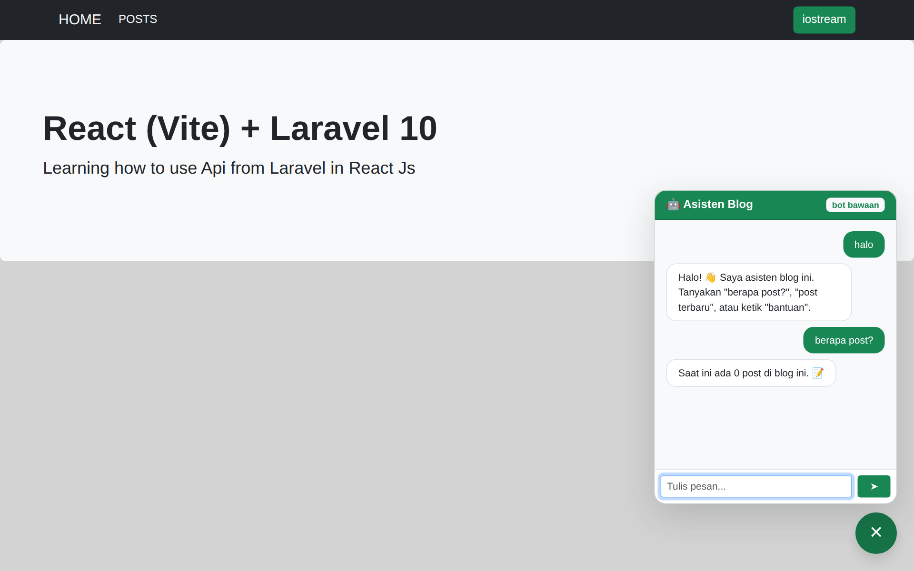

# 🔗 React + Laravel API

Contoh arsitektur **SPA React terpisah dari backend REST API Laravel** — kini dengan **Redis** (cache & riwayat chat) dan **chatbot** yang otaknya bisa dihubungkan ke **n8n**.

```
react-laravel-api/
├── laravel-10-api/              # Backend: REST API (Laravel 12) + Redis + endpoint chatbot
├── react-js-crud/               # Frontend: SPA React 18 + Vite + widget chat melayang
├── docker-compose.yml           # Redis + n8n sekali jalan
└── docs/n8n/chatbot-workflow.json  # workflow n8n siap impor
```

## Tampilan



## Fitur

**CRUD Post** — API resource Laravel + halaman React (daftar, tambah, ubah, hapus dengan upload gambar)

**Redis**
- Daftar post di-cache per halaman dengan **pola cache berversi**: setiap create/update/delete menaikkan `posts:ver` sehingga cache lama otomatis tak terpakai (cache busting tanpa menghapus key satu-satu)
- **Riwayat percakapan chatbot** disimpan per sesi di Redis (TTL 1 jam)
- **Rate limit** chatbot (20 pesan/menit per sesi) lewat RateLimiter berbasis cache

**Chatbot 🤖**
- Widget chat melayang di pojok SPA (gelembung 💬 → panel percakapan)
- Endpoint `POST /api/chat` meneruskan pesan ke **webhook n8n** (`N8N_WEBHOOK_URL`) — pasang AI Agent/LLM di n8n sesukamu
- **Fallback bot bawaan** bila n8n belum dikonfigurasi/tidak terjangkau: menjawab jumlah post, post terbaru, panduan — aplikasi selalu berfungsi
- Badge di header chat menunjukkan sumber jawaban: `n8n` atau `bot bawaan`

## Menjalankan

```bash
# 1. Redis + n8n
docker compose up -d          # Redis :6379, n8n :5678

# 2. Backend
cd laravel-10-api
composer install
cp .env.example .env && php artisan key:generate
# sesuaikan DB; CACHE_DRIVER=redis (atau 'file' bila tanpa Redis)
php artisan migrate
php artisan serve             # API di :8000

# 3. Frontend
cd ../react-js-crud
npm install
npm run dev                   # http://localhost:5173
```

### Menghubungkan n8n

1. Buka http://localhost:5678 → buat akun lokal
2. Import `docs/n8n/chatbot-workflow.json` → **Activate**
3. Di `.env` backend: `N8N_WEBHOOK_URL=http://localhost:5678/webhook/chatbot`
4. Ganti node *Code* di workflow dengan **AI Agent** (OpenAI/Gemini/Ollama) untuk jawaban cerdas — kontrak sederhananya: terima `{message, history}`, balas `{reply}`

## Tech Stack

| Bagian | Teknologi |
|---|---|
| Backend | Laravel 12 · MySQL · **Redis (predis)** · PHP ≥ 8.2 |
| Frontend | React 18 · Vite · React Router 6 · Axios |
| Otomasi | **n8n** (webhook chatbot) · Docker Compose |

## Riwayat

- 2023 — dibangun dengan Laravel 10 (nama repo semula: react-laravel-10-api)
- Okt 2026 — backend dipugar ke Laravel 12
- Okt 2026 — **ditambah Redis** (cache berversi, riwayat chat, rate limit) dan **chatbot n8n** dengan fallback bot bawaan — 7 test otomatis
